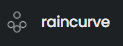
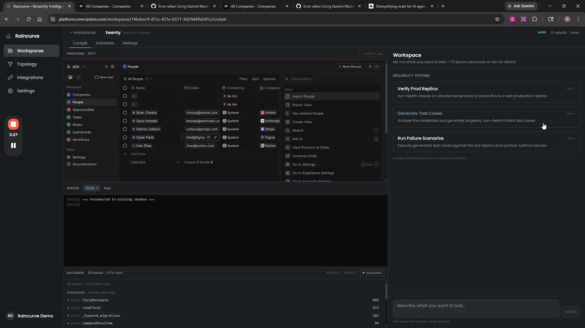

<p align="center">
  
</p>


<p align="center">
  <!-- TODO: Uncomment and update these badges as applicable -->
  <!-- <a href="https://raincurve.dev/docs"></a> -->
  <!-- <a href="https://discord.gg/YOUR_INVITE"></a> -->
  <a href="https://github.com/raincurve/raincurve-cli/blob/main/LICENSE"></a>
  <a href="https://www.python.org/downloads/"></a>
  <a href="https://www.docker.com/"></a>
</p>

**One command to run a prod instance of your code locally.** Point Raincurve at a project directory and AI agents analyze the stack, generate Dockerfiles, spin up databases and caches, stub external APIs, seed realistic data, run smoke tests, and hand you a production-grade sandbox — all in Docker, all automatic. No manual setup, no hunting for env configs, no "works on my machine."

```bash
cd any-project/
raincurve sandbox
```

### Raincurve on a hosted environment

> This demo shows Raincurve running inside [Raincurve](https://platform.overcastsre.com), our hosted platform that spins up sandboxes in cloud E2B boxes instead of local Docker. The agent analyzes the codebase, brings up a full production replica, then automatically generates and runs failure scenarios against it.

<p align="center">
  
</p>

> The CLI does the same thing locally on your machine with Docker. The main application is the cloud-hosted version.

<table>
<tr><td><b>Stack-agnostic analysis</b></td><td>Reads your code, package files, and project docs to detect frameworks, databases, caches, queues, and external dependencies — Python, Node.js, Go, Java, Ruby, or anything else.</td></tr>
<tr><td><b>Builds what's missing</b></td><td>Generates optimized Dockerfiles if none exist. When builds fail, a recovery agent reads the error logs, diagnoses the issue, and patches the Dockerfile — automatically, with unlimited retries.</td></tr>
<tr><td><b>Full service mesh</b></td><td>Spins up PostgreSQL, MySQL, MongoDB, Redis, Elasticsearch, RabbitMQ, and more as Docker containers on a private network. Each service gets the right version, the right config, and the right health check.</td></tr>
<tr><td><b>External API stubs</b></td><td>Detects dependencies on Stripe, SendGrid, Twilio, AWS S3, and others by scanning imports and <code>.env</code> files. Starts mock HTTP servers so the sandbox runs without real API keys. For LLM APIs (OpenAI/Anthropic), your real key is passed through.</td></tr>
<tr><td><b>Realistic data seeding</b></td><td>After the app is healthy, a seeder agent hits your API endpoints to populate the sandbox with plausible fake data — users, orders, posts, whatever your app models.</td></tr>
<tr><td><b>E2E smoke testing</b></td><td>Runs automated end-to-end tests against the running sandbox to verify critical flows work before handing it over to you.</td></tr>
<tr><td><b>Chat interface</b></td><td>Talk to your running sandbox: run shell commands, automate the browser UI via Playwright, add/remove containers, scale services — all through natural language.</td></tr>
<tr><td><b>Live browser viewer</b></td><td>A local web UI that streams real-time browser interaction. The agent drives the app via accessibility tree extraction (not screenshots), and you watch the actions live.</td></tr>
<tr><td><b>File watching</b></td><td>Edit your code locally — Raincurve detects changes, debounces, and triggers an automatic rebuild inside the container.</td></tr>
<tr><td><b>Snapshot & restore</b></td><td><code>raincurve down</code> commits running containers as images and archives volumes. <code>raincurve up</code> restores everything. Keeps the last 3 snapshots automatically.</td></tr>
</table>

---

## Quick Install

### pip (recommended)

```bash
pip install raincurve
```

### From source

```bash
git clone https://github.com/raincurve/raincurve-cli.git
cd raincurve-cli
pip install -e ".[dev]"
```

<!-- TODO: Uncomment when install scripts are published -->
<!-- ### Linux / macOS / WSL2
```bash
curl -fsSL https://raincurve.dev/install.sh | sh
```

### Windows (PowerShell)
```powershell
irm https://raincurve.dev/install.ps1 | iex
``` -->

### Prerequisites

- **Python 3.11+**
- **Docker** — must be running (`docker info` should succeed)
- **An LLM API key** — OpenRouter (default, 200+ models), Anthropic (Claude), or OpenAI

---

## Getting Started

```bash
# 1. Configure your LLM provider
raincurve init

# 2. Navigate to any project
cd your-project/

# 3. Spin up the sandbox
raincurve sandbox
```

That's it. Raincurve reads your codebase, builds containers, starts services, runs migrations, seeds data, and verifies health — then drops you back to your terminal with a running sandbox.

### What happens under the hood

```
┌─────────────────────────────────────────────────────────────────┐
│  raincurve sandbox                                              │
│                                                                 │
│  1. Read docs    — CLAUDE.md, README, CONTRIBUTING, .cursorrules│
│  2. Analyze code — frameworks, DBs, caches, external deps       │
│  3. Infra setup  — Docker containers for each detected service  │
│  4. Build & run  — Dockerfile generation, migrations, health    │
│  5. Seed data    — realistic data via API endpoints             │
│  6. Smoke test   — E2E verification of critical flows           │
└─────────────────────────────────────────────────────────────────┘
```

Each step is handled by a dedicated AI agent with its own tool set, limits, and verification logic. If a Docker build fails, the recovery agent kicks in automatically. The process prioritizes accuracy over speed — it will retry until things work.

---

## CLI Reference

| Command | Description |
|---------|-------------|
| `raincurve sandbox` | Analyze the current directory and spin up a full sandbox |
| `raincurve sandbox -y` | Skip the trust confirmation prompt |
| `raincurve sandbox -y --json` | Structured JSON output (for CI / agent integration) |
| `raincurve init` | Configure your LLM provider and API key |
| `raincurve login` | Authenticate with raincurve.dev |
| `raincurve chat` | Interactive chat with your running sandbox |
| `raincurve chat "message"` | One-shot chat (non-interactive) |
| `raincurve chat --json "msg"` | Structured JSON chat output |
| `raincurve up` | Restore sandbox from the last snapshot |
| `raincurve down` | Snapshot and tear down the running sandbox |
| `raincurve doctor` | Check Docker, disk, RAM, and auth readiness |
| `raincurve help` | Show detailed help and examples |
| `raincurve --version` | Print version |

### Chat tools

When inside `raincurve chat`, the agent has access to:

| Tool | What it does |
|------|-------------|
| `bash` | Execute shell commands inside sandbox containers (30s timeout, blocking commands rejected) |
| `browser` | Visual UI automation via Playwright — drives the app through its accessibility tree |
| `reconfigure` | Add/remove containers, scale replicas, configure load balancers |
| `done` | End the chat session |

---

## Architecture

Raincurve is built around a multi-agent system where each agent is a specialist with its own tools, system prompt, and resource limits.

```
raincurve/
├── agents/                    # LLM-powered agent system
│   ├── base_agent.py          # Generic agent loop (Anthropic + OpenAI)
│   ├── code_analysis_agent.py # Codebase understanding
│   ├── environment_agent.py   # Main build agent (Dockerfiles, migrations, health)
│   ├── infra_agent.py         # Infrastructure setup
│   ├── recovery_agent.py      # Docker build failure diagnosis + patching
│   ├── seeder_agent.py        # Realistic data population
│   ├── e2e_agent.py           # End-to-end smoke testing
│   └── chat_agent.py          # Interactive sandbox interface
├── browser/                   # Playwright-based UI automation
│   ├── manager.py             # Browser container lifecycle
│   ├── container_script.py    # Accessibility-tree-driven browser control
│   └── viewer.py              # Local live viewer (port 19876)
├── cli/                       # Typer command implementations
├── config/                    # Pydantic config schemas (global + project)
├── context/                   # Shared state between agents
├── docker/                    # Docker SDK utilities
├── models/                    # Data models (CodeContext, etc.)
├── pipe/                      # LLM-backed API mock server
├── services/                  # Service recipes (Postgres, Redis, etc.)
├── snapshot/                  # Container commit + volume archival
├── stubs/                     # External API mock servers
├── ui/                        # Rich-based terminal output
├── watcher/                   # File change detection + auto-rebuild
├── orchestrator.py            # SandboxOrchestrator — the main pipeline
└── main.py                    # CLI entry point
```

### Agent system

Every agent inherits from `BaseAgent`, which provides:

- An agentic tool-use loop that runs until the agent calls `done`
- Support for both Anthropic and OpenAI APIs (and OpenRouter)
- Configurable wallclock and tool-call limits
- Automatic output truncation for long tool results
- Verification of `done` results before exiting

| Agent | Tool-call limit | Wallclock limit | Role |
|-------|:-:|:-:|------|
| CodeAnalysisAgent | — | — | Understands the codebase structure |
| InfraAgent | — | — | Sets up infrastructure containers |
| EnvironmentAgent | 100 | 900s | Builds and runs the main application |
| RecoveryAgent | 20 | 120s | Fixes Docker build failures |
| SeederAgent | — | — | Populates the app with realistic data |
| E2EAgent | — | — | Runs end-to-end smoke tests |
| ChatAgent | 60 | 600s | Interactive sandbox interaction |

### Browser automation

The browser system uses **accessibility tree extraction** rather than screenshots to drive UI interactions. This gives the LLM a structured, numbered list of interactive elements instead of pixel data — more reliable, faster, and works with any web framework. Screenshots are captured after each action and streamed to the live viewer for human observation, but the LLM never sees them.

### Configuration

Two config levels:

| Level | Location | Contains |
|-------|----------|----------|
| Global | `~/.raincurve/config.json` | Auth tokens, LLM provider/key, resource budgets, trusted paths |
| Project | `.raincurve/config.json` | Project name, network, services, saved env vars |

**Default resource budgets:** 14 GB RAM, 240 GB disk, 20 containers max.

**Docker conventions:**
- Container names: `rc-{hash}` (app), `rc-{hash}-{service}` (auxiliary)
- Network: `rc-{hash}-net`
- Port range: `30000–39999`
- All containers labeled `rc-aux-of={project}` for cleanup

---

## How Raincurve differs

Most local dev tools give you a `docker-compose.yml` template and call it a day. Raincurve takes a different approach:

- **No config files to write.** You don't create Dockerfiles, compose files, or env templates. The agents read your code and figure it out.
- **Handles the messy parts.** Migrations, health checks, service discovery, port allocation, dependency ordering — all automated.
- **Self-healing builds.** When a Docker build fails, the recovery agent reads the error, patches the Dockerfile, and retries. You don't debug `apt-get` failures.
- **External API stubs.** Your app calls Stripe? Raincurve starts a mock Stripe server. No real API keys needed for local dev.
- **Works on any stack.** Python, Node.js, Go, Java, Ruby — the agents are language-agnostic. If it can run in Docker, Raincurve can sandbox it.

---

## Contributing

We welcome contributions! Clone the repo and install in editable mode:

```bash
git clone https://github.com/raincurve/raincurve-cli.git
cd raincurve-cli
pip install -e ".[dev]"
```

### Development commands

```bash
# Lint and format
ruff check raincurve/
ruff format raincurve/

# Type check
mypy raincurve/

# Run tests
pytest
pytest tests/test_foo.py              # single file
pytest tests/test_foo.py::test_bar    # single test
```

### Code style

- Python 3.11+, Pydantic v2 for all models, Typer for CLI
- Ruff for linting and formatting (line length 100, target py311)
- Build system: Hatchling
- All agent prompts must be OS-agnostic and codebase-agnostic

---

## Community

<!-- TODO: Add links as they become available -->
<!-- - **Website:** https://raincurve.dev -->
<!-- - **Docs:** https://raincurve.dev/docs -->
<!-- - **Discord:** https://discord.gg/YOUR_INVITE -->
- **Issues:** https://github.com/raincurve/raincurve-cli/issues

---

## License

Apache 2.0 — see [LICENSE](LICENSE).
